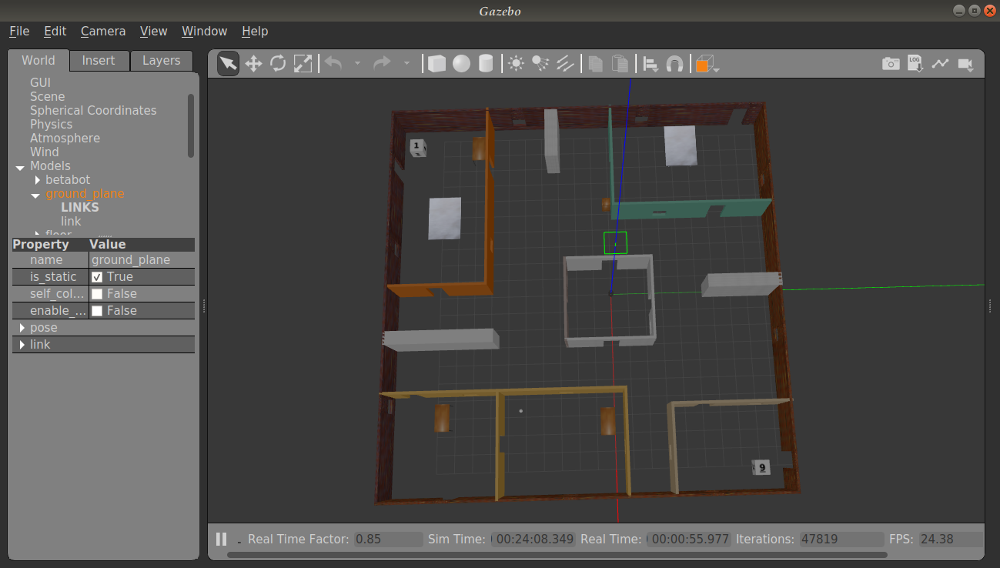
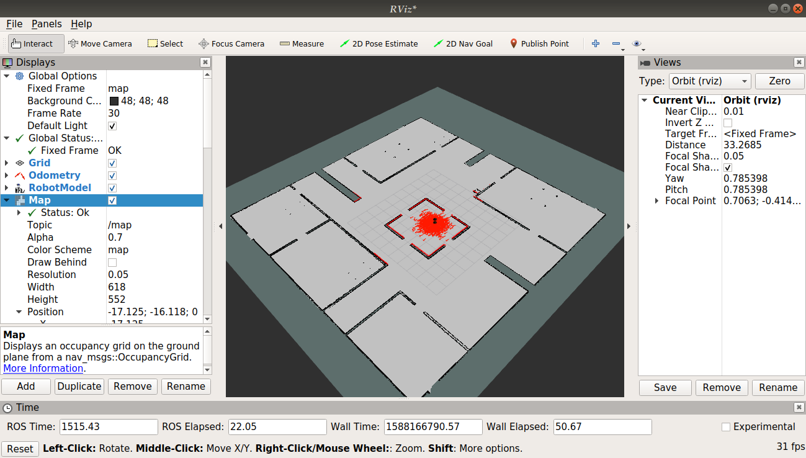
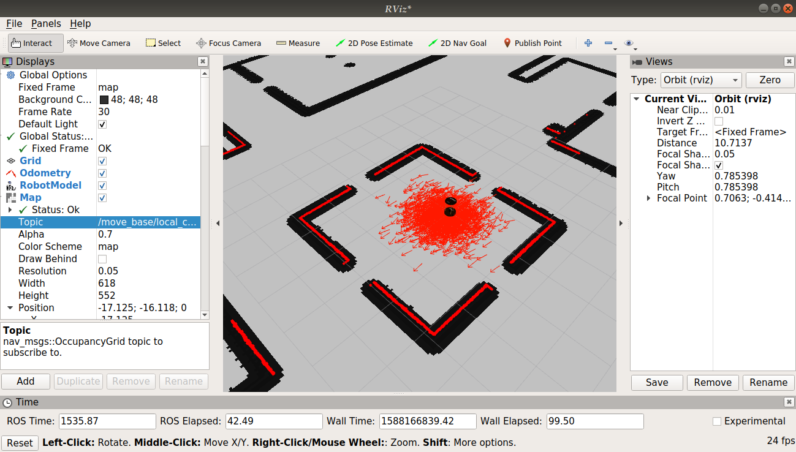

# Betabot Localization and Navigation

- [Betabot Localization and Navigation](#betabot-localization-and-navigation)
  - [Project Description](#project-description)
  - [GUID](#guid)
  - [Project Rubric](#project-rubric)
  - [After you implement the pkg state your reflection below](#after-you-implement-the-pkg-state-your-reflection-below)
  - [Part I: Map (map_server)](#part-i-map-mapserver)
    - [In your own words how maps are represented in ROS?](#in-your-own-words-how-maps-are-represented-in-ros)
    - [State 5 algorithm for SLAM and the ROS implementation](#state-5-algorithm-for-slam-and-the-ros-implementation)
  - [Part II: Localization (amcl)](#part-ii-localization-amcl)
    - [In your own words how amcl works?](#in-your-own-words-how-amcl-works)
    - [Is there other better approaches to localize your robot rather than amcl?](#is-there-other-better-approaches-to-localize-your-robot-rather-than-amcl)
    - [What are the amcl limitations or the fail cases?](#what-are-the-amcl-limitations-or-the-fail-cases)
    - [Is amcl used in domain rather than Robotics?](#is-amcl-used-in-domain-rather-than-robotics)
  - [Part III: Navigation (move_base)](#part-iii-navigation-movebase)
    - [How many official local planner available in ROS?](#how-many-official-local-planner-available-in-ros)
    - [which local planner did you use?](#which-local-planner-did-you-use)
    - [In your own words how the local planner you selected works?](#in-your-own-words-how-the-local-planner-you-selected-works)
    - [How many official global planner available in ROS?](#how-many-official-global-planner-available-in-ros)
    - [which global planner did you use?](#which-global-planner-did-you-use)
    - [In your own words how the global planner you selected works?](#in-your-own-words-how-the-global-planner-you-selected-works)
    - [State your suggestion increase the overall performance?](#state-your-suggestion-increase-the-overall-performance)
    - [List the most time consuming problems you faced](#list-the-most-time-consuming-problems-you-faced)
    - [Demos](#demos)
    - [Screenshots](#screenshots)
      - [NAME:](#name)
      - [ID:](#id)

## Project Description 

Create a ROS package with custom launch files to localize the robot in an environment given the map and also to autonomous navigation. 

*Use the given [map](map/map2d.yaml) for the myoffice world [here](../betabot_gazebo/worlds/myoffice.world)* 

   
  

>NOTE: For the given map and a world the betabot robot should localize it self and move from currant pose to a given goal autonomously

## GUID
Follow where am I project from Udacity Software Robotics Engineer Nanodegree.

---
## Project Rubric

 

---

## After you implement the pkg state your reflection below 

---
## Part I: Map (map_server)

###  In your own words how maps are represented in ROS?
In the map_server, the map is represented by two files:
1- An image showing a blueprint of the enviroment. In our case, the white
represented the free space while the black represented objects and obstacles.
2- A .yaml file that gives information about the map such as the resolution,
the origin of the map, or the threshold for defining an obstacle or a free space.

###  State 5 algorithm for SLAM and the ROS implementation

| SLAM Algorithm | ROS implementation |
|:--------------:|:------------------:|
|   GMapping     |      gmapping      |
|   HectorSLAM   |    hector_slam     |
|   KartoSLAM    |    slam_karto      |
|   RTAB-Map     |    rtabmap_ros     |
|   ORB-SLAM     |    orb_slam2_ros   |

---

## Part II: Localization (amcl)

### In your own words how amcl works?
It uses the Monto Carlo Localization algorithm and dynamicaly adjusts the pose and
number of particles (that represent the probability of the robot being at that position and having that pose) as the robot navigates through the enviroment of a known map. Moreover, it tries to match the sensor measurements (laser scan data) and odometry to the given map in order to localize itself.

### Is there other better approaches to localize your robot rather than amcl?
We may fuse different methods together. For example, use the robot_localization package with the AMCL.

### What are the amcl limitations or the fail cases?
AMCL won't work well in a dynamic enviroment.
Due to it being on a 2D map, some objects may be discarded due to their height.
### Is amcl used in domain rather than Robotics?
No. While searching I only found applications related to robotics or electric vehicles.
---

## Part III: Navigation (move_base)
#based on this link: https://drive.google.com/drive/folders/1IeCvGB36NjkEFb6JAemw4eQLB7CHbFta
### How many official local planner available in ROS?
base-local-planner, dwa-local-planner, eband-local-planner, mpc-local-planner and teb-local-planner.
### which local planner did you use?
base-local-planner/TrajectoryPlannerROS.
### In your own words how the local planner you selected works?
It is based on Trajectory Rollout and Dynamic Window Approach (DWA) algorithms.
The algorithm is described here: http://wiki.ros.org/base_local_planner
### How many official global planner available in ROS?
carrot-planner, nav-fn and global-planner
### which global planner did you use?
NavfnROS 
### In your own words how the global planner you selected works?
It uses Dijkstra’s algorithm to find a global path with minimum cost between
start point and end point (uniform cost search algorithm).

---

### State your suggestion increase the overall performance?
Use robot_localization package.

### List the most time consuming problems you faced
Adjusting the parameters in the configuration files.
The robot was not able to get out of doors at first.
---

### Demos
Add unlisted youtube/drive videos

[Demo](https://drive.google.com/drive/folders/1jv-rVjbIb7YVUmlJ_LgjPshhcoX4sHNp)

### Screenshots
1. rviz with all navigation launchers from turtulbot
2. gazebo

---

#### NAME: Dina Adel
#### ID: 201601463

---
